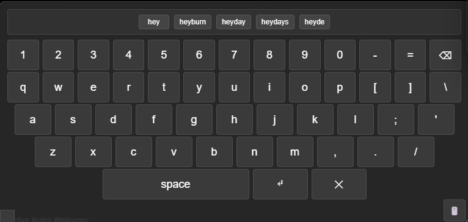
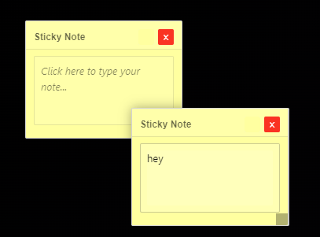

# Sticky Notes Wallpaper for Wallpaper Engine

A beautiful and functional notetaking wallpaper that allows you to create, edit, resize, and manage sticky notes directly on your desktop.


*The virtual keyboard with predictive text suggestions*


*Creating and managing sticky notes on your desktop*

## Features

- **Create Notes**: Click the "+ Add Note" button to create new sticky notes
- **Drag & Drop**: Move notes around by dragging them
- **Resize Notes**: Drag the bottom-right corner to resize notes
- **Color Customization**: Change note colors using the color picker
- **Virtual Keyboard**: Interactive on-screen keyboard with predictive text
- **Word Suggestions**: Smart word completion and next-word predictions
- **Text Editing**: Click inside any note to edit the text
- **Auto-Save**: All notes are automatically saved to Wallpaper Engine properties
- **Delete Notes**: Click the "×" button to remove notes
- **Clear All**: Remove all notes with the "Clear All" button
- **Persistent Storage**: Notes persist between wallpaper sessions
- **Screen Boundary Detection**: Automatically avoids taskbar and screen edges

## How to Use

### Basic Note Management
1. **Adding Notes**: Click the "+ Add Note" button in the top-right corner
2. **Moving Notes**: Click and drag anywhere on a note (except the text area or resize handle)
3. **Resizing Notes**: Drag the small handle in the bottom-right corner of each note
4. **Editing Text**: Click inside the text area of any note to start typing
5. **Changing Colors**: Use the color picker in the top-right of each note
6. **Deleting Notes**: Click the red "×" button in the top-right of each note
7. **Clear All**: Use the "Clear All" button to remove all notes at once

### Virtual Keyboard
**Note**: Wallpaper Engine disables physical keyboard input for security reasons, so this wallpaper includes a virtual on-screen keyboard for text input.

1. **Opening Keyboard**: Click inside any note's text area to open the virtual keyboard
2. **Typing**: Use the on-screen keyboard to type your notes
3. **Word Suggestions**: See predictive text suggestions at the top of the keyboard
4. **Accepting Suggestions**: Click on suggestion buttons to insert words
5. **Moving Keyboard**: Drag the 🖱️ button or the keyboard background to move it
6. **Resizing Keyboard**: Drag the resize handle in the bottom-left corner
7. **Closing Keyboard**: Click outside the note or press the ✕ button

## Installation

1. Open Wallpaper Engine
2. Click "Open from file"
3. Select the `project.json` file from this folder
4. The wallpaper will load with all functionality ready to use

## Customization

The wallpaper includes several customizable properties in Wallpaper Engine:

- **Scheme Color**: Changes the overall theme color
- **Default Note Color**: Sets the default color for new notes
- **Show Instructions**: Toggle the instruction panel visibility
- **Auto Save**: Enable/disable automatic saving of notes

## Technical Details

- Built with vanilla JavaScript (no external dependencies)
- Uses Wallpaper Engine's properties system for data persistence
- Virtual keyboard with predictive text using a comprehensive word list
- Responsive design that works on any resolution
- Screen boundary detection to avoid taskbar and edges
- Optimized for performance with smooth animations
- Compatible with Wallpaper Engine's HTML wallpaper format

## File Structure

```
notepad/
├── index.html              # Main HTML file
├── notepad.js              # Main JavaScript functionality
├── word_list.js            # Comprehensive word list for predictive text
├── project.json            # Wallpaper Engine configuration
├── scene.json              # Scene configuration
├── styles.css              # CSS styling
├── convert_words.py        # Python script to convert word lists
├── words.txt               # Source word list (optional)
├── shaders/                # GLSL shaders for 3D effects
├── Docs/
│   └── Images/            # Screenshots and documentation images
└── README.md              # This file
```

## Browser Compatibility

This wallpaper works best in modern browsers that support:
- HTML5 localStorage
- CSS3 animations and transforms
- Modern JavaScript ES6+ features

## Virtual Keyboard Features

**Why Virtual Keyboard?**: Wallpaper Engine disables physical keyboard input for security reasons, so this wallpaper includes a comprehensive virtual keyboard solution.

- **Full QWERTY Layout**: Complete keyboard with numbers, letters, and symbols
- **Predictive Text**: Smart word suggestions based on what you're typing
- **Next-Word Predictions**: Suggests common next words after completing a word
- **Resizable Interface**: Drag the bottom-left corner to resize the keyboard
- **Movable**: Drag the 🖱️ button or keyboard background to reposition
- **Click-Outside-to-Close**: Automatically closes when clicking outside the note
- **Responsive Sizing**: Keys scale proportionally with keyboard size

## Troubleshooting

- **Notes not saving**: Make sure Wallpaper Engine properties are working correctly
- **Virtual keyboard not appearing**: Click inside a note's text area to open it
- **Word suggestions not working**: Check that word_list.js is properly loaded
- **Performance issues**: Try reducing the number of notes if you have many
- **Display issues**: Ensure your graphics drivers are up to date

## License

This project is open source and available under the MIT License.

---

Enjoy your interactive sticky notes wallpaper! 📝✨ 